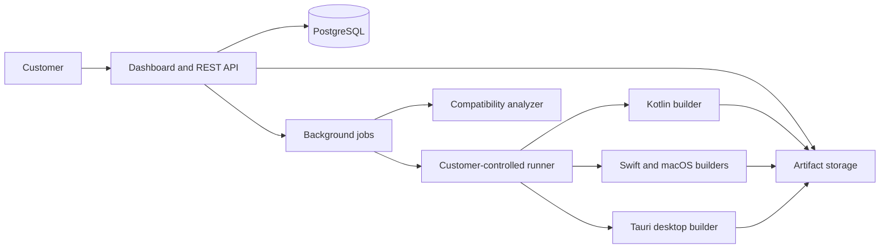

# WebToApp Architecture

Status: target architecture for v1

WebToApp is an open-source modular monolith with separately runnable web, job,
and customer-runner processes. A canonical, immutable application specification
is compiled into dedicated mobile shells and a shared Tauri desktop shell.

## System context



The hosted control plane coordinates work and stores metadata. The runner
performs privileged build and signing operations on customer infrastructure.
Signing material never crosses that boundary.

## Repository boundaries

| Area                     | Responsibility                                                                                           |
| ------------------------ | -------------------------------------------------------------------------------------------------------- |
| `apps/control-plane`     | Next.js dashboard, Hono `/v1` API, authentication, tenancy, projects, builds, releases, and SSE          |
| `apps/jobs`              | Graphile Worker tasks for analysis, policy evaluation, lifecycle transitions, cleanup, and notifications |
| `packages/app-spec`      | Canonical JSON Schema, validation, canonicalization, and generated TypeScript models                     |
| `packages/sdk-js`        | Typed, origin-scoped web-to-native request client                                                        |
| `packages/policy-engine` | Signed, versioned compatibility and store-readiness rule packs                                           |
| `crates/wta`             | Rust CLI and customer-controlled runner                                                                  |
| `runtimes/android`       | Kotlin/AndroidX WebView application shell                                                                |
| `runtimes/ios`           | SwiftUI/WKWebView application shell                                                                      |
| `runtimes/desktop`       | Tauri 2 application shell for Windows, macOS, and Linux                                                  |

All components are Apache-2.0 licensed. Managed hosting, build capacity,
support, and enterprise operations are commercial services built from the same
public codebase.

## Control plane

The control plane is deployed as a small number of process types from one
TypeScript workspace:

- **Web/API process:** Next.js UI with Hono REST endpoints and OpenAPI 3.1.
- **Job process:** Graphile Worker using PostgreSQL as its durable queue.
- **Analyzer workers:** sandboxed, network-restricted Playwright sessions and
  static-bundle inspection.

PostgreSQL is the source of truth. Drizzle owns schema migrations. Every
tenant-owned record contains `organization_id`; row-level security is mandatory
and application authorization is an additional layer, not a substitute.
S3-compatible storage holds inputs, build outputs, release manifests, SBOMs, and
provenance through short-lived signed URLs.

Better Auth supplies sessions, passkeys, organizations, roles, and organization
API keys. OpenTelemetry emits correlated logs, metrics, and traces. Development
uses Docker Compose; the initial production topology is one region with
multi-zone PostgreSQL and versioned object storage.

Redis, Kubernetes, Temporal, and service-to-service RPC are intentionally
excluded from v1.

## Canonical application contract

`AppSpecV1` is defined once as JSON Schema. Generated TypeScript, Kotlin, Swift,
and Rust models are checked against common fixtures in CI. It describes:

- identity and platform identifiers;
- URL or static-bundle source;
- ownership records and exact allowed origins;
- branding and native navigation;
- declared capabilities and their permission explanations;
- target platforms, architectures, package formats, and signing references;
- compliance and store-review metadata; and
- release channel and update policy.

A project draft is mutable. Creating a build freezes a canonicalized revision
and its SHA-256 digest. The job envelope references that digest and the source,
template, policy, and toolchain digests. Secret references may appear in the
spec; secret values may not. Bundle identifiers and signing lineage become
immutable after the first signed release.

## Build orchestration

Each platform target follows this state machine:

```text
queued -> leased -> preparing -> building -> validating
       -> awaiting_signing -> signing -> verifying -> completed
```

`failed`, `cancelled`, and `expired` are terminal alternatives. Leases have
heartbeats and expiry. Stages publish idempotent outputs and may resume after an
ordinary process restart. Signing and publishing are never blindly retried.

Runner enrollment uses a one-time token followed by an Ed25519 device identity
and a rotating mTLS certificate stored in the operating-system keychain. The
runner establishes outbound connections only and is limited to one organization.
Every claimed job carries a control-plane signature, nonce, expiry, frozen spec
digest, source digest, target, template version, and toolchain digests.

Build commands use structured arguments and isolated temporary directories.
Templates are read-only; logs are redacted; CPU, memory, time, output size, and
network access are bounded. After validation, each artifact receives a SHA-256
digest, platform signature result, CycloneDX SBOM, toolchain/template metadata,
and signed in-toto-style provenance.

## Runtime architecture

Dedicated mobile runtimes allow precise WebView policy and store-native
integration. Tauri provides one desktop codebase while retaining each operating
system's native WebView.

Every runtime enforces these invariants:

- production content is HTTPS and transport errors fail closed;
- main-frame in-app navigation is limited to exact verified origins;
- unknown origins, popups, and ordinary external links open in the system
  browser;
- OAuth uses the platform's secure external authentication session;
- native capabilities default to disabled and require spec declaration, origin
  authorization, and a user gesture where applicable;
- bridge messages use a typed `{ id, method, params }` envelope, schema
  validation, rate limits, and a 256 KB limit;
- large files use operating-system file handles or streams rather than base64
  bridge payloads; and
- release builds disable debugging, cleartext, arbitrary file access, wildcard
  handlers, and unrestricted popups.

Android uses exact-origin `WebViewCompat.addWebMessageListener` with main-frame
checks and never exposes `addJavascriptInterface`. iOS validates both the source
origin and `WKFrameInfo.isMainFrame`. Remote desktop content receives no generic
Tauri command surface; trusted local chrome mediates every native action.

## API contracts

The `/v1` REST API exposes organizations, memberships, projects, domain
verifications, analyses, policy reports, spec drafts and revisions, runners,
builds and targets, artifacts, releases, audit events, and usage records.

- OpenAPI generates supported clients.
- Collections use cursor pagination.
- Errors use `{ code, message, details, requestId }`.
- Build and release creation require `Idempotency-Key`.
- Build progress is delivered by Server-Sent Events.
- Outgoing webhooks are signed and include `analysis.completed`,
  `build.updated`, `build.completed`, and `release.ready`.

## Ownership verification and analysis

Release builds require either DNS TXT verification or an HTTPS proof at
`/.well-known/webtoapp-verification.json`. Verification applies to exact origins
used by the runtime.

URL analysis combines bounded HTTP inspection with a sandboxed Playwright
session. Network policy resolves and pins public addresses, repeats validation
after every redirect and subresource resolution, and denies private, loopback,
link-local, and metadata ranges. Authenticated or private-network analysis is
available only through the customer's runner.

Static bundles are inspected without executing customer code. Extraction occurs
only after path normalization, link rejection, duplicate detection, and
compressed/extracted/file-count limits pass.

## Failure and recovery model

- Server and runner restarts leave durable build state in PostgreSQL and object
  storage.
- Expired leases return non-signing stages to a safe retry point.
- Every mutating API operation that can create duplicate external work is
  idempotent.
- Object versions, checksums, and provenance detect artifact corruption or
  replacement.
- PostgreSQL point-in-time recovery and object versioning target a 15-minute RPO
  and four-hour RTO; restores are exercised quarterly.
- Store, certificate-authority, and notarization failures are represented as
  external dependency failures rather than control-plane availability failures.

Architecture decisions with material tradeoffs are recorded in [`adr/`](adr/).
