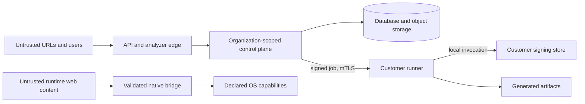

# WebToApp Threat Model

Status: required security baseline for v1

This document covers the hosted control plane, analyzers, object storage,
customer runner, build templates, native runtimes, JavaScript bridge, and
generated artifacts. It assumes the public Internet, submitted URLs, uploaded
bundles, and rendered web content are hostile.

## Security objectives

1. A tenant cannot read, mutate, build, or sign another tenant's data.
2. Submitted URLs and bundles cannot reach control-plane private networks or
   escape their sandbox.
3. Remote web content cannot acquire undeclared native capability or escape the
   application shell.
4. Signing keys never leave customer custody and cannot be invoked by an
   unauthenticated or replayed job.
5. Every released artifact is traceable to an immutable spec, source, template,
   policy, and toolchain set.
6. Logs, telemetry, and URLs do not leak credentials or customer content.
7. The service resists abusive use for unauthorized republishing, malware
   distribution, and resource exhaustion.

## Assets

- Customer identity, organization membership, and API credentials.
- Domain-verification records and rights attestations.
- App specifications, source bundles, build inputs, and release metadata.
- Signing identities on customer machines.
- Runner device keys and mTLS credentials.
- Built applications, update manifests, checksums, SBOMs, and provenance.
- Database contents, object-storage credentials, webhook secrets, and
  operational telemetry.
- Build capacity, analyzer network access, and the reputation of the WebToApp
  project.

## Actors and assumptions

- **Authorized customer:** may make mistakes or have a compromised account.
- **Malicious tenant:** intentionally submits hostile URLs, archives,
  identifiers, or metadata.
- **Hostile website:** changes content after analysis, redirects dynamically, or
  sends malicious bridge messages.
- **Network attacker:** attempts interception, DNS rebinding, replay, or
  artifact substitution.
- **Compromised runner:** can affect its own organization's builds; it must not
  affect another tenant or the control plane.
- **Dependency or template compromise:** injects behavior into generated
  applications or build tooling.
- **Service operator:** has operational access to the control plane but must not
  possess customer signing keys.

The customer is responsible for securing its runner host, store accounts,
signing credentials, website, and web backend. WebToApp remains responsible for
validating jobs, isolating tenants, constraining generated native surfaces, and
preserving evidence.

## Trust boundaries

Crossing any boundary requires authentication, authorization, schema validation,
resource limits, and auditable identity. TLS alone is not authorization.

## Threats and required controls

| Threat                                              | Required controls                                                                                                                                                                                                  | Verification                                                                             |
| --------------------------------------------------- | ------------------------------------------------------------------------------------------------------------------------------------------------------------------------------------------------------------------ | ---------------------------------------------------------------------------------------- |
| SSRF, redirect pivot, or DNS rebinding              | Resolve and pin public IPs; reject loopback, private, link-local, reserved, and metadata ranges; repeat checks for redirects and subresources; restrict analyzer egress; cap time, bytes, redirects, and processes | Malicious DNS, IPv4/IPv6, redirect-chain, alternate-notation, and metadata fixtures      |
| Archive traversal or decompression abuse            | Normalize paths before extraction; reject absolute paths, `..`, symlinks, hard links, device files, duplicate normalized paths, excessive ratios, size, and file count; never execute bundle scripts               | ZIP Slip, link, collision, bomb, and limit tests                                         |
| Stored/reflected XSS in dashboard                   | Context-safe rendering, strict CSP, output encoding, sanitized rich text, HttpOnly/Secure/SameSite cookies, CSRF protection for cookie-authenticated writes                                                        | Browser security tests and dependency scanning                                           |
| Tenant breakout or insecure direct object reference | Organization ID on every tenant record, PostgreSQL row-level security, service-layer authorization, opaque UUIDv7 IDs, negative cross-tenant tests                                                                 | Automated matrix covering every resource and role                                        |
| Unauthorized republishing                           | DNS or well-known ownership verification before release build; rights attestation; abuse reports, takedown, and suspension workflows                                                                               | Verification expiry and authorization tests; audit review                                |
| Native bridge escalation                            | Empty default capability set; exact-origin and main-frame checks; typed schema; allowlisted methods; permission rationale; user gestures; message rate and size limits                                             | Fuzzing plus hostile iframe, popup, origin-spoof, replay, and oversized-message fixtures |
| Navigation or OAuth credential theft                | Exact allowed origins; system-browser OAuth; external links leave the app; reject TLS errors, cleartext, mixed content, and untrusted popups                                                                       | Navigation, certificate, redirect, popup, and OAuth fixtures                             |
| Android JavaScript interface exploitation           | Use `WebViewCompat.addWebMessageListener` with exact origin rules and `isMainFrame`; prohibit `addJavascriptInterface`                                                                                             | Static checks and instrumentation tests                                                  |
| Generic desktop command access                      | Keep Tauri commands inaccessible to remote content; use trusted local UI as broker; allowlist structured requests                                                                                                  | Runtime integration and command-surface tests                                            |
| Command, path, or installer injection               | Never interpolate user data into shell text or filesystem paths; use structured process arguments, internal IDs, normalized staging paths, and safe metadata escaping                                              | Property tests with shell metacharacters, Unicode, reserved names, and long inputs       |
| Forged, replayed, or cross-tenant build job         | Runner bound to one organization; mTLS; signed envelope containing tenant, target, digests, nonce, and expiry; single-use leases; clock-skew bounds                                                                | Forged signature, changed digest, replay, expiry, and wrong-tenant tests                 |
| Signing-key exfiltration or unintended signing      | Keys remain in OS keychain/keystore; control plane stores fingerprints only; runner displays/records exact identity; signing stage is non-retriable without reconciliation; redact subprocess output               | Tests with missing/wrong identities and interrupted signing; manual platform validation  |
| Build workspace escape                              | Fresh isolated directory, read-only templates, no source scripts, bounded environment, least-privilege process, restricted network, safe cleanup with verified absolute paths                                      | Sandbox escape probes and post-job residue checks                                        |
| Artifact replacement or downgrade                   | SHA-256 content addressing, immutable release manifest, platform signature verification, signed update metadata, SBOM, signed provenance, anti-downgrade policy in runtime                                         | Tamper, rollback, wrong-signer, and corrupt-upload tests                                 |
| Webhook spoofing or replay                          | Per-destination secret, signed timestamped payload, stable event ID, short acceptance window, documented idempotency                                                                                               | Invalid signature, old timestamp, duplicate event, and secret-rotation tests             |
| Secret leakage                                      | No secret values in AppSpec; secret scanning; structured redaction; strip URL credentials/query/fragment; prevent environment dumps; short-lived object URLs                                                       | Canary-secret and log-snapshot tests                                                     |
| Supply-chain compromise                             | Locked dependencies, pinned toolchains, reviewed template changes, CodeQL and dependency review, build provenance, SBOMs, release signature checks                                                                 | Clean reproducible builds and provenance verification                                    |
| Resource exhaustion                                 | Per-account/org/IP/runner/project quotas, request and artifact limits, bounded analyzers/builds, backpressure, leases, and cancellation                                                                            | Concurrency, large input, slow response, and quota tests                                 |
| Malware distribution                                | Ownership checks, malware scanning, capability transparency, immutable audit trail, abuse response, takedown, and account suspension                                                                               | Scanner fixtures and incident tabletop exercise                                          |

## Security invariants

- Release-mode network policy is fail-closed; TLS errors are never bypassed.
- Exact origins are used instead of wildcards. An origin includes scheme, host,
  and port.
- New origins, permissions, capabilities, and native code require a binary
  rebuild.
- Remote content cannot invoke generic platform APIs.
- Secret references and public key fingerprints may be persisted; private
  signing material may not.
- User-controlled labels and identifiers never determine a filesystem path or
  command string.
- A build is accepted only when its returned spec and source digests match the
  leased job.
- No artifact is marked released until signature and digest verification
  succeed.

## Privacy controls

- Public analysis does not accept login credentials.
- Private or authenticated analysis runs through the customer's runner.
- Telemetry is structured and minimized; it excludes page bodies, authentication
  headers, URL query strings, and fragments.
- Device push tokens are delivered to the customer's backend and are not
  retained by the platform in v1.
- Scratch data is deleted after every job; logs and unreleased artifacts expire
  after 30 days by default.

## Residual risks

- A verified website may become malicious or compromised after analysis. Runtime
  containment limits native impact, but cannot make hostile web content
  trustworthy.
- A compromised customer runner or signing account can produce malicious
  artifacts for that customer. Provenance and audit records aid detection;
  control-plane isolation limits blast radius.
- Store policies and WebView behavior change independently of WebToApp. Signed
  policy packs and pinned toolchains reduce surprise but do not guarantee
  approval.
- OS WebViews inherit security defects until vendors patch them. Supported OS
  baselines and update guidance are part of release policy.

## Release security gates

### Current preview boundaries

The preview API performs bounded, stateless AppSpec validation only; client
ownership claims are never passed as verified policy context. URL fetching is a
library operation with public-IP pinning and per-redirect validation, not a
public endpoint. ZIP inspection streams and verifies contents without
extraction. See [the analyzer](../packages/analyzer/README.md) for enforced
limits.

Database isolation tests run PostgreSQL through PGlite with a non-superuser
role, including unset-tenant access and cross-tenant foreign-key attempts.
Production auth/session scoping and worker roles remain unimplemented. Do not
run tenant queries under the development PostgreSQL superuser.

Native preview shells deny capabilities and restrict main-frame navigation.
Tauri's remote window receives no local-command capability; popups are denied.
Android checks exact origins and main-frame identity before responding to bridge
requests, which currently only receive capability-disabled errors. iOS registers
no script message handler. Device security and full browser behavior matrices
remain release gates.

No milestone may be called production-ready with an unresolved critical or high
severity finding. Before GA, verify tenant isolation, analyzer egress, archive
extraction, bridge origin enforcement, runner job signatures, artifact
provenance, backup restoration, abuse response, and supported-platform package
signatures. Report vulnerabilities through the process in
[`../SECURITY.md`](../SECURITY.md), not a public issue.
